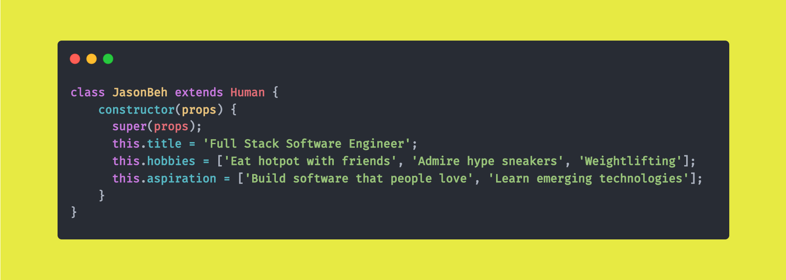

<h2> Hey there! I'm Jason Beh.</h2>

<h3> 😎 About Me </h3>

- ❤  &nbsp; Exploring new technologies and developing software.
- 🎓 &nbsp; Rising Freshman of Computer Science(Advanced) at University of Adelaide.
- 💡  &nbsp; Interested in Machine Learning & Software Architecture.
- 🌱 &nbsp; Currently grinding Leetcode.
- 😊 &nbsp; Open to internships and learning opportunities.

<h3>🛠 Tech Stack</h3>

- 💻 &nbsp; HTML | CSS | JavaScript | Node.js | React | Python | Redux
- 🛢 &nbsp; MongoDB
- 🔧 &nbsp; Git | Markdown | Gulp

<h3> 🤝🏻 Connect with Me </h3>

